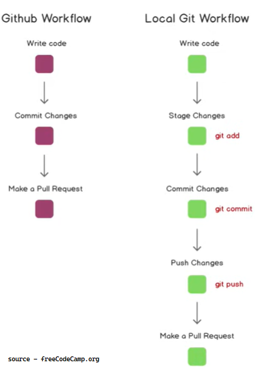
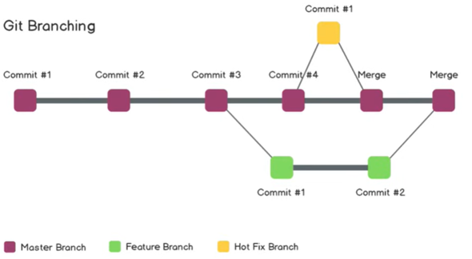

#Themen

1. [Git & Github Tutorial](git--github-tutorial)

# Git & Github Tutorial

## Begriffe

Verzeichnis – Ordner
Terminal oder Befehlszeile – Schnittstelle für Textbefehle
CLI – Befehlszeilenschnittstelle
cd – Verzeichnis wechseln
Code-Editor – Textverarbeitungsprogramm zum Schreiben von Code
Repository – Projekt oder der Ordner/Ort, in dem Ihr Projekt gespeichert ist
Git – Tool, das die Änderungen am Code im Laufe der Zeit verfolgt
Github – Eine Website zum Online-Hosten Ihrer Repositories

## Git Befehle

clone – Ein Repository, das irgendwo gehostet wird, wie zum Beispiel auf Github, in einen Ordner auf deinem lokalen Rechner kopieren.
add – Deine Dateien und Änderungen in Git verfolgen.
commit – Deine Dateien in Git speichern.
push – Git-Commits auf ein entferntes Repository hochladen, wie zum Beispiel auf Github, Gitlab, etc.
pull – Änderungen von einem entfernten Repository auf deinen lokalen Rechner herunterladen, das Gegenteil von push.

## Install Git on Linux - Debian / Ubuntu (apt-get)

-   Install LINUX on WSL
    windows command line öffnen:
    wsl –list –online
    wsl –install –d <Distro name>
    oder von Microsoft Store Debian herunterladen

-   Installieren Sie Git von Ihrer Shell aus mit apt-get:
    sudo apt-get update
    sudo apt-get install git
-   Überprüfen Sie durch Eingabe, ob die Installation erfolgreich war
    git --version
    git version 2.9.2

## Neues Repository erstellen

-   In github eine neue repo erstellen
-   SSH Schlüssel in github.com erstellen
-   In VS Code Terminal öffnen in einem freiausgewählte datei wo das Repo dupliciert werden soll
    git clone git@github.com:Totuhov/learning_git.git
    cd learning_git
-   Alle Dateien und Verzeichnisse anzeigen, auch versteckte
    ls –la (nicht funktionieren)
    ls –Hidden für VS Code Terminal
-   git status
-   Wenn wir ein neues datei erstellen, es is nicht verfolgt von git
    git add <datei- oder verzeichnisname>
    git add . für alles
-   COMMIT und PUSH
    git commit –m “comment“ [-m ”description”]
    git push [origin] [master]

5. Git Branching (Verzweigung)

git branch

-   main

## Branch erstellen

git checkout –b <newBranchName>

-   newBranchName
    main

*   Wechseln zwishen Zweige
    git checkout main
    git checkout newBranchName
*   Save changes to the new branch
    git add . or git add [filename]
    git commit –m “Comment”
*   Uterschiede prüfen
    git diff newBranchName in the main branche
*   Merge lokal
    git merge newBranchName in the main branche (not so common)

    git push
    fatal: The current branch feature-readme-instructions has no upstream branch.
    To push the current branch and set the remote as upstream, use

*   Push in github
    git push –-set-upstream origin newBranchName or
    git push –u origin newBranchName
*   Erstelle Pull Request
*   In github (Compare and pull request)
*   Lokal
    git checkout main
    git merge feature-readme-instructions
    git push origin main
*   Branch löshen
    git branch –d newBranchName

1 Merge Konflikte
Wenn ein Zweig ist modifiziert und das „main“ auch, mann Kann nicht wechseln zwischen die Zweige. Erstmal commit main dann kann er die Zweige wechseln. Dann zo zweite Zweig und merge master. Oder erst pull request to main branch von gitgub und dann git merge master. Dann kommt Mergekonflikt die mit der Hilfe von editor speichern wir beide mit commit.

## Undoing in git

git reset nach add
git reset HEAD nach commit HEAD ist pointer zu dem letzten commit

wenn wir nicht zu den letzten commit gehen mochten sondern zu ein alterer:
git log
git reset <hashOfThecommit> die Änderungen sind da amer nicht commitet mehr
git reset --hard Alle commits sind gelöscht

## Forking

-   In Git bezieht sich "forking" auf den Prozess, bei dem du eine Kopie eines Git-Repositories erstellst. Der Hauptzweck des Forkens besteht darin, dass du Änderungen an der geklonten Kopie vornehmen und dann einen sogenannten "Pull Request" (PR) erstellen kannst, um diese Änderungen in das Original-Repository einzufügen. Dies ist besonders häufig auf Plattformen wie GitHub.

-   Repository forken: Du erstellst eine Kopie (Fork) eines Repositories auf einer Plattform wie GitHub. Dies wird normalerweise durch einen "Fork" Button auf der Plattform ermöglicht.
-   Clone des geforkten Repositories: Du klonst die kopierte Version des Repositories auf deinen lokalen Computer, um Änderungen vorzunehmen:
    git clone https://github.com/dein-Benutzername/geforktes-Repository.git
-   Änderungen vornehmen: Du machst die gewünschten Änderungen in deinem lokalen geklonten Repository.
-   Commit und Push: Du führst die folgenden Git-Befehle aus, um deine Änderungen zu commiten und auf dein geforktes Repository hochzuladen:
    git add .
    git commit -m "Beschreibung der durchgeführten Änderungen"
    git push origin master
-   Pull Request erstellen: Auf der Plattform (z.B., GitHub) navigierst du zu deinem geforkten Repository und erstellst einen "Pull Request". Dies ist eine Anfrage an den Besitzer des Original-Repositories, deine Änderungen in sein Repository zu übernehmen.
    Änderungen übernehmen: Der Besitzer des Original-Repositories kann deine Änderungen überprüfen und entscheiden, ob er sie in sein Repository übernehmen möchte.
